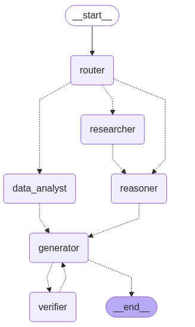

# Multi-Agent Question Answering System using Reflex

[](./LICENSE)

This repository implements a **Multi-Agent Question Answering System (QAMAS)** using the **Reflex framework**, an event-driven architecture for orchestrating specialized agents to collaboratively solve complex natural language questions.  

The system was built for both **general-purpose question answering** and for the **GAIA Hands-on Challenge** from the [Hugging Face Agents Course – Unit 4](https://huggingface.co/learn/agents-course/unit4/hands-on).

---

## 🧠 Overview

Reflex enables modular, reactive agents to operate asynchronously and communicate in dynamic pipelines. In this project, agents are specialized for reasoning, data analysis, research, generation, and verification. The system routes each question through a customized pipeline, depending on its type.

---

## ✨ Features

- ✅ Modular agent design using Reflex
- ✅ Dynamic routing based on question type
- ✅ Factual, logical, and data-driven question answering
- ✅ End-to-end pipeline with answer verification
- ✅ Compatible with Hugging Face’s GAIA evaluation
- ✅ Fully interactive Jupyter notebooks for demonstration

---

## 📐 System Architecture

Each query is handled by one of the following Reflex agent pipelines:

### Agent Roles

| Agent           | Description |
|-----------------|-------------|
| **Router**      | Analyzes the query and chooses the appropriate processing path. |
| **Researcher**  | Gathers up-to-date external information. |
| **Reasoner**    | Performs logical reasoning and mathematical computations. |
| **Data Analyst**| Parses and analyzes structured/tabular data. |
| **Generator**   | Formats responses into concise answers. |
| **Verifier**    | Evaluates and provides feedback to improve the final answer. |

### Pipeline Routes

Depending on the question type, one of these flows is selected:

- **Structured Data**:  
  `Router → Data Analyst → Generator → Verifier → Generator`

- **Multi-hop (Factual + Reasoning)**:  
  `Router → Researcher → Reasoner → Generator → Verifier → Generator`

- **Logical/Mathematical**:  
  `Router → Reasoner → Generator → Verifier → Generator`

<div align="center">
  
  <p><em>Figure 1: Multi-Agent Pipeline Graph showing different processing routes</em></p>
</div>

---

## 📂 Project Structure

    ├── LICENSE
    ├── Makefile             
    ├── README.md             
    ├── config
    │   ├── requirements.txt  
    │   ├── settings.yaml     
    ├── data
    │   ├── external         
    │   ├── interim
    │   ├── processed        
    │   └── raw
    ├── notebooks
    │   ├── answer-gaia-questions.ipynb        
    │   └── answer-simple-question.ipynb
    │   └── images
    │      └── multi_agents_graph.png
    ├── src
    │   └── agent  
    │      └── prompt.py
    │      └── question_answering.py
    │      └── tool.py
    │      └── utils.py
    │      └── workflow.py
    │   └── data
    │      └── extract.py
    │      └── load.py
    │   └── tools 
    │      └── audio.py
    │      └── startup.py
    │      └── utils.py

---

## 🚀 Getting Started

### 1. Clone the Repository

```bash
git clone git@github.com:casals90/question-answering-multi-agent.git
cd question-answering-multi-agent
```

### 2. Set Up Environment Variables

This system relies on environment variables to configure user permissions, API access, and Jupyter behavior.

#### 🔧 Step-by-Step

1. **Copy the template file:**

```bash
cp .env.demo .env
```

2. **Edit ```.env``` to include the required values.**

Below is a description of each variable:

Copy the example .env file and fill in required values:
```bash
cp .env.demo .env
```

You can retrieve your UID and GID with:
```bash
printf "UID=$(id -u)\nGID=$(id -g)\n"
```

👤 User Permissions

| Variable | Description                                |
| -------- | ------------------------------------------ |
| `UID`    | Your user ID (for Docker volume ownership) |
| `GID`    | Your group ID (for Docker volume access)   |

```bash
printf "UID=$(id -u)\nGID=$(id -g)\n"
```
🧪 Jupyter Configuration

| Variable             | Description                                        |
| -------------------- | -------------------------------------------------- |
| `JUPYTER_TOKEN`      | Token required to access JupyterLab UI             |
| `JUPYTER_ENABLE_LAB` | Set to `TRUE` to enable JupyterLab                 |
| `GRANT_SUDO`         | Set to `yes` to allow sudo access in the container |

🌐 External APIs

| Variable         | Description                                             |
| ---------------- | ------------------------------------------------------- |
| `GOOGLE_API_KEY` | API key for accessing Google Search (if used by agents) |
| `TAVILY_API_KEY` | API key for [Tavily](https://www.tavily.com/) search    |
| `OPENAI_API_KEY` | API key for accessing OpenAI models                     |

> ⚠️ These keys are required if your agents rely on external tools for information retrieval or generation.

🤗 Hugging Face Integration

| Variable        | Description                                                |
| --------------- | ---------------------------------------------------------- |
| `HF_TOKEN`      | Your Hugging Face access token                             |
| `HF_AGENT_CODE` | Code used for submitting answers in the GAIA challenge     |
| `HF_USERNAME`   | Your Hugging Face username (used for challenge submission) |

> 💡 Make sure not to commit your ```.env``` file to version control. Add it to your ```.gitignore``` for security:

### 3. Check Docker Volumes
```bash
volumes:
  - ./data/models:/data/models
  - ./data/processed:/data/processed
  - ./data/raw:/data/raw
  - ./reports:/reports
```

Customize them in ```docker-compose.yml``` if needed.

### 4. Start the System (JupyterLab)

```bash
make deploy_jupyter
```

Press ```CTRL + C``` to stop it. Then:

```bash
make jupyter_down
```

## 🧪 Notebooks

✅ answer-gaia-questions.ipynb
- Automates the Hugging Face's Agents Course GAIA challenge workflow.
- Fetches questions, routes through agents, submits answers.

✅ answer-simple-question.ipynb
- Allows users to manually ask and answer questions interactively.
- Good for exploration and testing agent collaboration.


## 📄 License

This project is licensed under the MIT License.

## 🙋‍ Contributing

Contributions are welcome! Please open issues or submit pull requests if you have suggestions, improvements, or bug reports.
